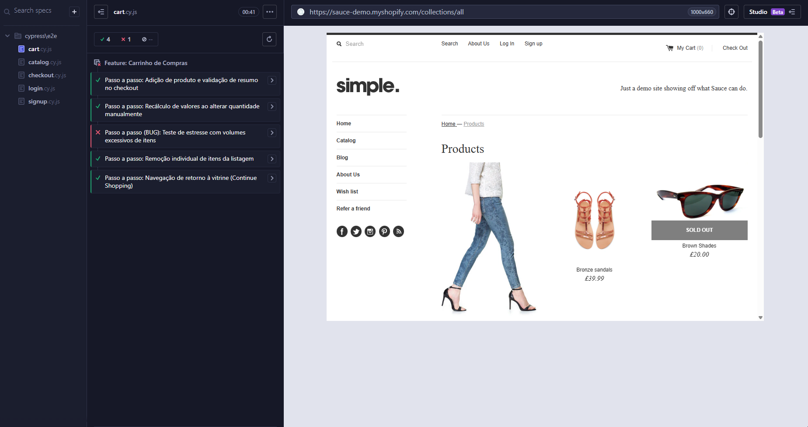
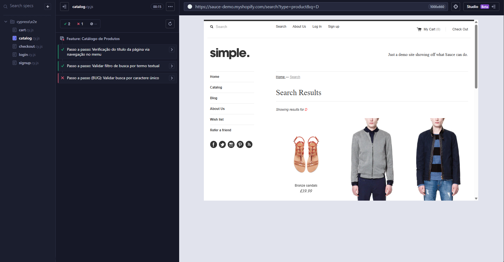

# Cypress E-commerce Automation

Este repositório contém uma automação de testes E2E (End-to-End) utilizando o framework [Cypress](https://www.cypress.io/). Este projeto foi desenvolvido para garantir a qualidade das funcionalidades principais de uma loja virtual fictícia baseada no ambiente de testes [Sauce Demo via Shopify](https://sauce-demo.myshopify.com/).




## 🎯 Funcionalidades Cobertas (Features)

Os testes foram organizados de forma descritiva ("Passo a passo") detalhando cenários críticos do e-commerce:

- **Autenticação de Usuário (Login):** Validação de credenciais, mensagem de erro e logout.
- **Registro de Novo Usuário (Sign up):** Criação de conta dinâmica usando o `@faker-js/faker`, validação de campos obrigatórios e impedimento de contas duplicadas.
- **Catálogo de Produtos:** Funcionalidades de pesquisa via termo textual e navegação.
- **Carrinho de Compras:** Adição, recálculo de quantidades, tratamento de limite de valores, remoção de itens e limpeza global.
- **Fluxo de Checkout.**

## 📂 Estrutura do Projeto

Para facilitar a manutenção e legibilidade, a arquitetura do projeto isolou cada responsabilidade na pasta raiz do Cypress:

- **`cypress/e2e/`**: Contém as suítes de testes separadas por módulo funcional (`cart.cy.js`, `catalog.cy.js`, `login.cy.js`, `signup.cy.js`, `checkout.cy.js`).
- **`cypress/support/`**: Ponto central de customizações. Aqui residem os *Custom Commands*:
  - **Arquivos Globais:** (`commands.js`) Possuem os comandos de apoio compartilhados, como manipulação de erros com `cy.ignoreCollectError()`, limpeza de estado `cy.cleanCart()` e nossos **Comandos Customizados de Navegação** flexíveis (ex: `cy.navigateToLoginPage()`, `cy.navigateToCartPage()`).
  - **Módulos Específicos:** Diretórios divididos pelo escopo (`cart/`, `catalog/`, `login/`, `signup/`), cada um exportando ações específicas das suas jornadas (ex: `cy.fillRegistrationForm()`, `cy.addToCart()`).

## 🛠️ Pré-requisitos

Para executar este projeto, você precisará ter instalado em sua máquina:

- **[Node.js](https://nodejs.org/)** (Recomendado v22.22.0 ou versão LTS mais recente).
- **NPM** (Normalmente vem incluído com o Node.js).
- Navegador atualizado (Chrome, Edge ou Firefox).

## 🚀 Instalação e Uso

1. **Clone este repositório** para a sua máquina:

   ```bash
   git clone https://github.com/diogomasc/cypress-ecommerce-automation.git
   ```

2. **Navegue até o diretório do projeto**:

   ```bash
   cd cypress-ecommerce-automation
   ```

3. **Instale as dependências** do Node.js:

   ```bash
   npm install
   ```

4. **Execute os testes**:
   O projeto disponibiliza scripts NPM facilitadores para rodar as baterias de testes:

   - Para abrir a interface interativa (Runner UI) do Cypress:
     ```bash
     npm run cypress:web
     # ou
     npx cypress open
     ```
   
   - Para rodar todos os testes em segundo plano (Headless Mode):
     ```bash
     npm run cypress:headless
     # ou
     npx cypress run
     ```
